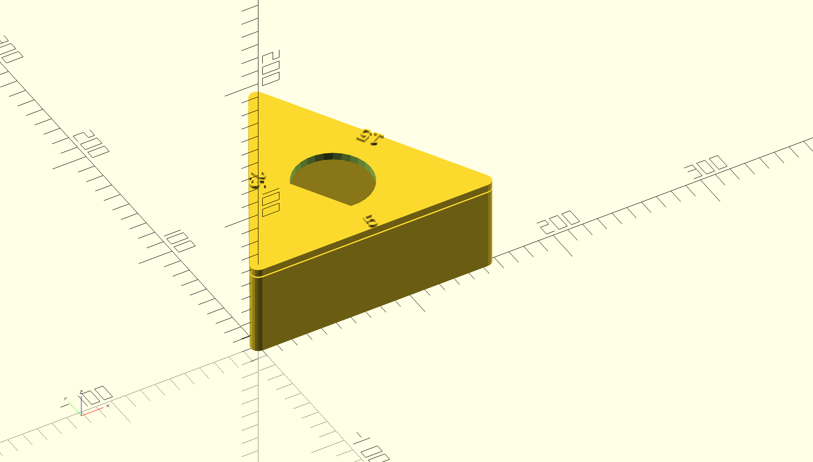

Pomodoro Timer
==============

A desktop pomodoro timer.



Peripherals
-----------

- [PCD8544](https://learn.adafruit.com/nokia-5110-3310-monochrome-lcd) 84x48 pixel LCD screen (SPI-based)
- [LSM6DSL](https://www.st.com/resource/en/datasheet/lsm6dsl.pdf) (PDF) iNEMO inertial module always-on 3D accelerometer and 3D gyroscope (I2C)
- TIM (General-purpose timer, onboard)
- GPIO reset button
- UART (onboard)

Code
----

I've either referenced, ported, or otherwise used these open source projects in my own:

- [Adafruit GFX Library](https://github.com/Adafruit/Adafruit-GFX-Library), [BSD License](https://github.com/adafruit/Adafruit-GFX-Library/blob/master/license.txt)
- [STMicroelectronics LSM6DSL accelerometer/gyro driver](https://github.com/STMicroelectronics/stm32-lsm6dsl), [BSD License](https://opensource.org/licenses/BSD-3-Clause)
- [STMicroelectronics HAL code](https://www.st.com/resource/en/user_manual/um1884-description-of-stm32l4l4-hal-and-lowlayer-drivers-stmicroelectronics.pdf) (PDF)
- [8x8 VGA Font](https://github.com/dhepper/font8x8), Public Domain License

Building
--------

Be sure to have already installed the [Arm GNU Toolchain](https://developer.arm.com/tools-and-software/open-source-software/developer-tools/gnu-toolchain).
Then this project can be built by the Makefile in the root directory.

```
make -j
```